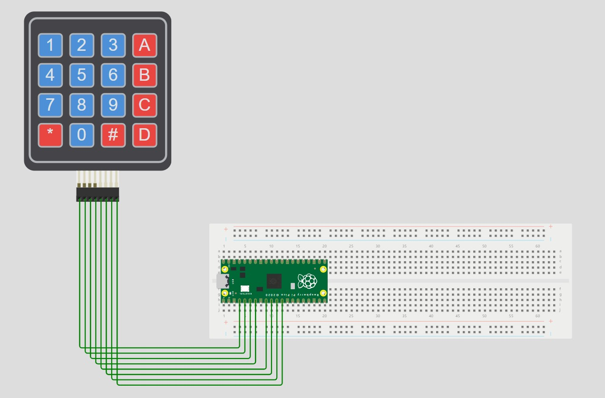

## SPRINT 1

# Tablero de Lavadora

Este proyecto consiste en el diseño e implementación de un tablero de control para una lavadora, que incluye funciones para diferentes tipos de lavado y un botón de encendido y apagado, cada uno controlando un LED correspondiente en el tablero.

## Funciones Implementadas

1. **Tipo de Lavado Delicado:** Esta función está diseñada para lavar prendas delicadas o de tejidos sensibles que requieren un tratamiento suave.

2. **Tipo de Lavado Normal:** Este modo de lavado es adecuado para prendas de uso diario y de tejidos comunes que no necesitan un lavado especial.

3. **Tipo de Lavado Fuerte:** Esta función está destinada a prendas con suciedad pesada o manchas difíciles que requieren un lavado más potente y prolongado.

## Botón de Encendido y Apagado

El tablero de control incluye un botón que permite encender y apagar la lavadora. Este botón proporciona la funcionalidad básica para encender la lavadora y apagarla.

## LED Indicador

Cada botón en el tablero de control está asociado con un LED indicador. Cuando presionas un botón, se enciende el LED correspondiente para indicar que la función asociada está activada.

## Uso del Tablero

Para utilizar el tablero de control de la lavadora, sigue estos pasos:

1. **Encendido de la Lavadora:** Presiona el botón de encendido para activar la lavadora. Esto encenderá el LED indicador correspondiente en el tablero.

2. **Selección del Tipo de Lavado:** Selecciona el tipo de lavado deseado utilizando los controles correspondientes en el tablero. Puedes elegir entre delicado, normal o fuerte, según el tipo de prendas y la cantidad de suciedad. Cada selección enciende el LED indicador respectivo en el tablero.

4. **Apagado de la Lavadora:** Una vez que el ciclo de lavado haya finalizado, presiona el botón de apagado para detener la lavadora y apagarla. Esto también apagará todos los LEDs indicadores en el tablero.

---
## SPRINT 2

## Teclado Matricial

### Tareas

- Diseñar la interfaz de usuario del teclado, decidiendo la disposición de las teclas y su funcionalidad.
- Programar la lógica necesaria para leer las teclas presionadas y responder adecuadamente a las entradas del usuario.
- Realizar pruebas exhaustivas para asegurar que el teclado funcione correctamente en todas las condiciones.
- Documentar la funcionalidad y el diseño del teclado para futuras referencias y mantenimiento.
- Realizar ajustes según sea necesario basados en los resultados de las pruebas y la retroalimentación del usuario.

### Definición de hecho:
El teclado está correctamente integrado en la lavadora y responde de manera precisa a las teclas presionadas por el usuario. Se ha probado exhaustivamente y se ha documentado su funcionamiento.

### Funcionalidad de Teclado
Esta funcionalidad sirve para permitir al usuario interactuar con la lavadora mediante la entrada de comandos desde un teclado. Utiliza un arreglo de pines GPIO de una placa Raspberry Pi Pico W para leer las teclas presionadas y devolver el carácter correspondiente.

## Funciones Implementadas

keypad_construct(const int a[]): Esta función toma un array a como argumento e inicializa algunos valores globales en el programa. Copia los valores del array a a los arrays globales ROWS_PINS y COLS_PINS, que representan los pines de las filas y columnas del teclado respectivamente. Además, inicializa la matriz KEYS con los valores de las teclas del teclado.

void keypad_init(): Esta función inicializa los pines GPIO necesarios para el funcionamiento del teclado. Recorre los pines definidos en ROWS_PINS y COLS_PINS, inicializa cada pin utilizando gpio_init() y establece la dirección del pin como salida para las filas y entrada con pull-down para las columnas utilizando gpio_set_dir() y gpio_pull_down() respectivamente.

char read_keypad(): Esta función escanea las teclas presionadas en el teclado. Primero, activa cada fila del teclado y luego lee el estado de las columnas. Si encuentra una tecla presionada, desactiva la fila y devuelve el carácter correspondiente según la matriz KEYS. Si no se presiona ninguna tecla, devuelve '\0'.

## Uso

Para utilizar la funcionalidad del teclado en tu se deben seguir estos pasos:

Copiar y pegar los archivos del directorio Teclado en el proyecto de implementación

1. Importar el archivo `pin_list_keypad.h`: En este archivo se definen los pines GPIO necesarios para el funcionamiento del teclado.

2. Importar el archivo `Teclado.h`: Este archivo contiene las declaraciones de variables y funciones necesarias para el funcionamiento del teclado.

3. Las funciones disponibles del teclado son las siguientes:

   - `void keypad_construct(int a[])`: Este método toma un array como argumento e inicializa valores necesarios para el teclado.
   - `void keypad_init()`: Inicializa los pines GPIO necesarios para el funcionamiento del teclado.

   - `char read_keypad()`: Lee la salida del teclado y regresa la opcion presionada.

## Maquetado
Diagrama de cableado para el teclado

