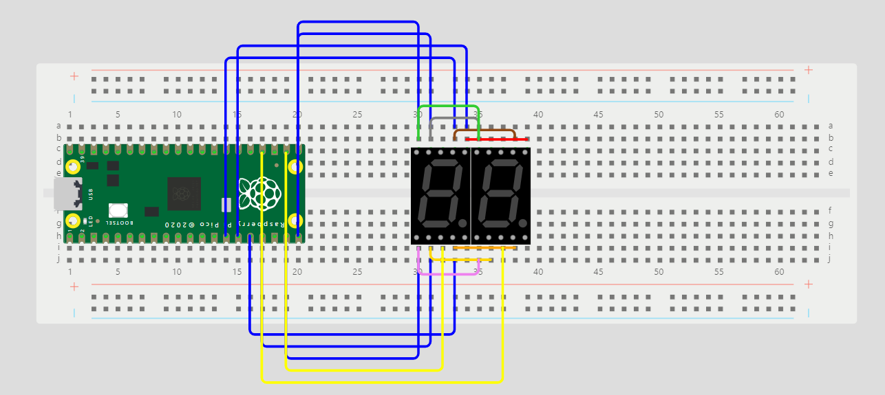

# Historias de usuario

## SPRINT 1

## Carga liviana/media/pesada
Como usuario de una lavadora, quiero poder seleccionar entre diferentes opciones de carga (liviana, media, pesada) para adaptar el ciclo de lavado a la cantidad de ropa que deseo lavar.

### Tareas
- Diseñar e implementar la funcionalidad de selección de carga de ropa en la interfaz de la lavadora.
- Adquirir los materiales necesarios para la implementación del selector de opciones de carga.
- Integrar el selector de carga en la interfaz de la lavadora de manera intuitiva y fácil de usar para el usuario.
- Realizar pruebas exhaustivas para garantizar que la lavadora responda correctamente a las diferentes opciones de carga seleccionadas.
- Documentar el funcionamiento del selector de carga y sus efectos en el ciclo de lavado.
- Realizar cualquier ajuste necesario basado en los resultados de las pruebas.

### Definición de hecho:
El selector de opciones de carga se encuentra en la interfaz de la lavadora y permite al usuario elegir entre las opciones de carga liviana, media o pesada cuál encenderá el led correspondiente a la selección. Después de encender el led la lavadora debería llenarse de agua correspondientemente a la carga.

---
##  Funcionalidad 
### Funcionalidad de Carga liviana/media/pesada
Esta funcionalidad forma parte de un sistema de control para seleccionar el carga. Se encarga de activar alguno de los tipos de carga mediante el control de tres LED´s a una placa Raspberry Pi Pico W.

### Descripción
La función liviana()/media()/pesada() proporcionana la capacidad de activar el tipo de carga de la lavadora. Cuando se les llama a estas funciones prenden unos LEDS especificos para cada uno a su vez que apaga los otros dos leds, indicando que tipo de carga está en uso.

## Uso
- Se importa el archivo de cabecera carga.h en el código principal.

#include "Enjuagar.h"

- Se llama a cualquiera de las 3 funciones en el programa para seleccionar el tipo de carga.

liviana();
media();
pesada();

---
## SPRINT 2

## Temporizador
Como usuario de una lavadora, quiero un display que muestre información relevante durante el ciclo de lavado para poder monitorear el progreso y realizar ajustes según sea necesario.

### Tareas
- Seleccionar el tipo de display adecuado para la lavadora que pueda mostrar información clara y legible.
- Diseñar la interfaz de usuario del display, decidiendo qué información será mostrada y cómo será presentada.
- Integrar el display en la estructura de la lavadora de manera que sea accesible para el usuario.
- Programar la lógica necesaria para que el display muestre la información correcta en cada etapa del ciclo de lavado.
- Realizar pruebas exhaustivas para asegurar que el display funcione correctamente en todas las condiciones.
- Documentar la funcionalidad y el diseño del display para futuras referencias y mantenimiento.
- Realizar ajustes según sea necesario basados en los resultados de las pruebas y la retroalimentación del usuario.

### Definición de hecho:
El display está correctamente integrado en la lavadora y muestra el tiempo restante para que termine el ciclo de lavado seleccionado. La información se presenta de manera clara y legible para el usuario. Se ha probado exhaustivamente y se ha documentado su funcionamiento.

### Funcionalidad de Temporizador
Esta funcionalidad sirve para mostrar el tiempo restante de un tipo de lavado en un display. Mostrará en dos display de 7 segmentos los segundos restantes a terminar el lavado y se mantendrá el 0 cuando llegue a este. Esto mediante los puertos de una placa Raspberry Pi Pico W.

### Descripción
time_construct(int a[]): Esta función toma un array a como argumento e inicializa algunos valores globales en el programa. Primero, copia los valores del array a al array global pins. Luego, inicializa un array bits que representa los patrones de bits para cada dígito (0-9). Después, copia estos patrones de bits al array global digits. Finalmente, inicializa algunas variables globales como digito_decenas, digito_unidades, digito1, digito2 y mask.

void time_init(): Esta función inicializa los pines GPIO necesarios para el funcionamiento del programa. Recorre todos los pines definidos en el array global pins, inicializa cada pin utilizando gpio_init() y establece la dirección del pin como salida utilizando gpio_set_dir().

int decrementar(): Esta función decrementa los dígitos de las unidades y las decenas del tiempo. Si el dígito de las unidades es 0 y el dígito de las decenas es mayor que 0, decrementa el dígito de las decenas y establece el dígito de las unidades en 9. Si ambos dígitos son 0, la función retorna 0. En otros casos, simplemente decrementa el dígito de las unidades. Finalmente, retorna el tiempo restante como un número entero.

void actualizar(int decenas, int unidades): Esta función actualiza la visualización del tiempo en el display. Toma dos argumentos, decenas y unidades, que representan los dígitos de las decenas y las unidades respectivamente. Primero, actualiza las variables globales digito_decenas y digito_unidades. Luego, genera máscaras de bits para los dígitos de las decenas y las unidades utilizando el array global digits y los pines definidos en pins. Establece la máscara de bits correspondiente a las decenas en los pines GPIO, enciende el dígito1 y apaga el dígito2 para mostrar el valor de las decenas. Espera un breve periodo de tiempo definido por time_delay. Luego, repite el proceso para las unidades, encendiendo el dígito2 y apagando el dígito1. Al finalizar, limpia las máscaras de bits y completa el ciclo de actualización del display.

## Uso
- Se debe de importar el archivo pin_list.h donde se definen los pines
- Se debe de importar el archivo temporizador.h donde se declarán las variables y funciones necesarias para el funcionamiento.
- Se debe de importar el archivo temporizador.c donde vienen los métodos que se quieren utilizar, los que serán:
 1) void time_construct(int a[]);
 2) void time_init();
 3) int decrementar();
 4) void actualizar(int decenas, int unidades);

## Maquetado

Como se puede observar, tengo los GPIO 10-16 para controlar los segmentos individuales del display, mientras que tengo los GPIO 17 y 18 para controlar que display se utilizará.